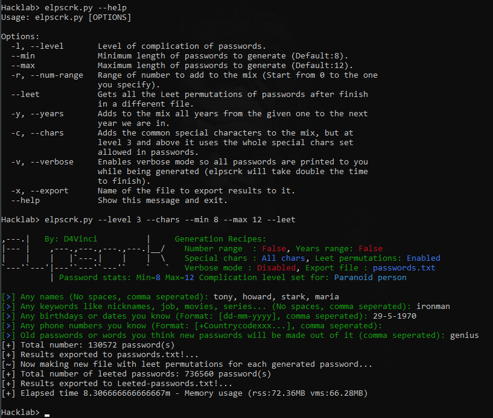

# Elpscrk - v2.0
An Intelligent common user-password profiler that's named after the same tool in Mr.Robot series S01E01 :smile:

In simple words, elpscrk will ask you about all info you know about your target then will try to generate every possible password the target could think of, it all depends on the information you give, the flags you activate, and the level of complication you specify.

There are 6 levels of complications in elpscrk for each type of target out there, starts from the simple person which is the default to nerd person, paranoid person till the final boss level which is nuclear level which could generate 1000000 passwords or more. :laughing:

Elpscrk is like cupp, but it's based on permutations and statistics while being memory efficient.
So you will get more results in nearly no time, complication levels for each type of user, and very customizable results as you will see in the usage part.

## Screenshot


## Usage
It's simple you just run the script and will prompt ask you about the info you know about the target then it will make permutations lists of each common mixes of the data as you will see next.

For more advanced usages and customizations, there are some things you need to pay attention to:
1. Complication levels 

It says how simple you want the generated passwords to be. So, for example given names:

    - At level 0, which is the default, each name you give will be converted to (UPPERCASE, lowercase), the First letter will be converted to (UPPERCASE, lowercase), 
      and first two letter will be converted to (UPPERCASE, lowercase, capitalized).
    - At level 1, you will see all things from level 0 but also each name reversed, and each first two letters of each name will be reversed too.

Here's a table explaining the whole complication levels:
> Note: In the general idea column, every thing mentioned is being used in many (common/not common) mixtures not alone

| Level               |  General idea |
|:-------------------:|---------------|
| 0 - Simple person   | This is the default level, here you expect a lot of things like names permutations explained above, dates are splited to groups of **days, months, years, last two number of year like 1990 & 90**, phone numbers are converted to **national format with a list of first/last four numbers** as it's commonly used and so on. |
| 1 - Average person  | Using this level will add some interesting things like for names, **each name reversed, and each first two letters of each name will be reversed too**, for dates, **0 will be appended to (days, months) lower than 10** so 5 will be 05 & 5 of course, **last 3 numbers of year will be used** also so 1990 will give 990.  |
| 2 - Cyber awareness | By default, old passwords you give will be used as it's given and any special chars will be removed from it, but starting from level 2 each given old password will be converted to (UPPERCASE, lowercase, capitalized, reversed) forms. |
| 3 - Paranoid person | By default, if you used the `--chars` flag, elpscrk will use the 10 most common chars as you are in level 0 or 1 but starting with 3 it will use the whole special characters set allowed in passwords (See references).  |
| 4 - Nerd person     | For level 3 and lower, elpscrk will be using orders pairs to make sure permutations are in order and cuts a lot of uncommon password forms in the mixes, now using level 4 will use same common mixtures but without pairs so for example instead of getting passwords of (names & dates), you will get mixes of (names & dates, names & names, dates & dates,...) and so on  |
| 5 - Nuclear!        | Here is where shit hits the fan :laughing:, elpscrk will starting using not common and not very realistic results for the most complicated unhuman targets lol.  |

> Note: Before all permutations in these levels starts, elpscrk will generate some of the most used forms of passwords using simple addition like cupp just to make sure it will be in the results.
     
2. Leet flag

When you enable the leet flag, elpscrk will work as normal and after finishing and exporting the results then it will start getting all leet permutations of all passwords and saves them into new file.

So, for example a name like `karim` will result to `['k4r1m', 'k4rim', 'kar1m', 'karim']`

3. Years and numbers ranges

Using `-y/--years` option and giving it a year like 1980 will make elpscrk mix all passwords with all the years from 1980 till 2022 (Year we are currently in+1) so you expect passwords like these:
```text
karim1980
1981karim
...
karim2022
```
and so on, the same applies to `-r/--num-range` option giving it number like 100 will add all numbers from 0 till 100 so expect passwords like `karim99, 99karim, karim100`...

## Installation
- It should run on any OS but needs python 3.6 and above.
- Clone the repo and in its directory install requirements like that:
`pip install -r requirements.txt` or this one `python3 -m pip install -r requirements.txt` if you have more than one version installed.
- You are ready to go 

## Contact
- [Twitter](https://twitter.com/D4Vinci1)
- [Telegram](https://t.me/D4Vinci_0x)

## Donation
If this tool has been useful for you, feel free to thank me by buying me a coffee :)

[](https://buymeacoffee.com/d4vinci)

# Disclaimer
- Elpscrk is created to raise cyber awareness about the importance of strong unpredictable passwords, and it's not responsible for misuse or illegal purposes.
- It can be used only for legal penetration tests or educational purpose...etc!
- Copying a code from this tool or using it in another tool is accepted as you mentioning the source and pull requests are always welcomed ofc. 😄

## References:
- [All allowed special characters in passwords](https://owasp.org/www-community/password-special-characters)
- [The most frequently-used special characters in passwords](https://www.reddit.com/r/dataisbeautiful/comments/2vfgvh/most_frequentlyused_special_characters_in_10/)